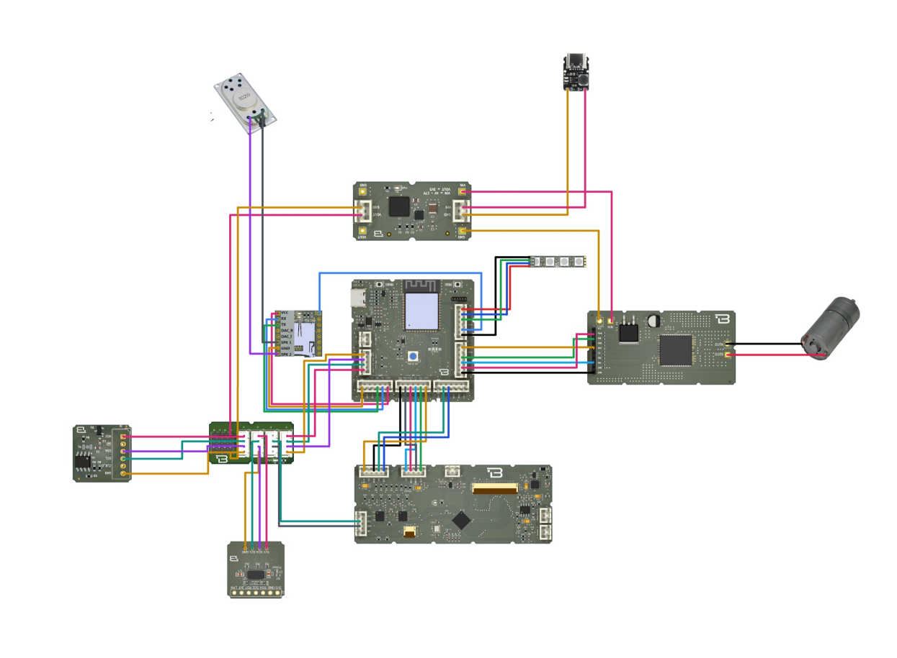

# Jet Engine Control Panel

An ESP32-S3 based interactive control module that simulates jet engine behavior.
Engine RPM is controlled from a capacitive touch display, with proximity-triggered
startup and synchronized engine audio.



## Features

- Touch-controlled RPM adjustment on a 480x272 display
- Proximity-based auto-start — the motor spins up when an object is detected
  within 300 mm
- Synchronized engine sound playback
- Addressable RGB status lighting
- Build flags to enable or disable each subsystem independently for isolated testing

## Hardware

| Component | Part | Interface |
|---|---|---|
| MCU | Boardoza Pulse ESP32-S3 | — |
| Display | Boardoza FT800 (480x272) | SPI |
| Touch controller | FT5426 capacitive | I2C |
| Motor driver | VNH5019A | PWM + GPIO |
| Distance sensor | VL53L5CX (8x8 ToF) | I2C |
| Audio | DFPlayer Mini | UART2 |
| RGB LEDs | T3A33BRG (4x) | SPI-like |

## Pinout

**Display (SPI)**

| Signal | GPIO |
|---|---|
| SCK | 17 |
| MOSI | 15 |
| MISO | 16 |
| CS | 7 |
| INT | 47 |
| PD | 48 |

**I2C bus** — shared by the touch controller and the ToF sensor

| Signal | GPIO |
|---|---|
| SDA | 1 |
| SCL | 2 |

**Motor driver**

| Signal | GPIO |
|---|---|
| INA | 36 |
| INB | 37 |
| PWM | 35 |
| ENA / ENB | 38 |

**Audio (UART2)**

| Signal | GPIO |
|---|---|
| RX | 44 |
| TX | 43 |

**RGB LEDs**

| Signal | GPIO |
|---|---|
| Data | 41 |
| Clock | 42 |

A full pinout diagram is available in [`docs/pinout-diagram.pdf`](docs/pinout-diagram.pdf).

## Repository Structure

```
src/jet_main/       Main firmware
test/lidar_test/    Standalone ToF sensor test sketch
test/mp3_test/      Standalone audio module test sketch
docs/               Pinout diagram and images
```

Each subsystem was brought up and verified with its own test sketch before being
integrated into the main firmware.

## Build Flags

The main sketch exposes four flags so that any subsystem can be disabled during
debugging:

```cpp
#define USE_MOTOR
#define USE_LED
#define USE_LIDAR
#define USE_MP3
```

## Dependencies

- `Boardoza_FT800.h`
- `VNH5019A.h`
- `T3A33BRG.h`
- `SparkFun_VL53L5CX_Library.h`
- `DFRobotDFPlayerMini.h`

## Implementation Notes

**Touch reads must be gated on the finger count.** The FT5426 is a capacitive
controller read over I2C, not a resistive panel. Reading coordinates directly
returns stale values; register `0x02` has to be polled for the active touch count
before `touchXPosition` / `touchYPosition` are called.

**The motor needs a separate supply.** Driving it from the same 3.3 V rail as the
ESP32 causes brownout resets the moment the motor draws current. The motor driver
was moved to its own supply rail to fix this.

**A solder splash killed the I2C bus.** Both the touch controller and the ToF
sensor share SDA/SCL, so a single short took out both at once and made the fault
look like two unrelated failures. Cleaning the short restored both.

## License

MIT — see [LICENSE](LICENSE).
